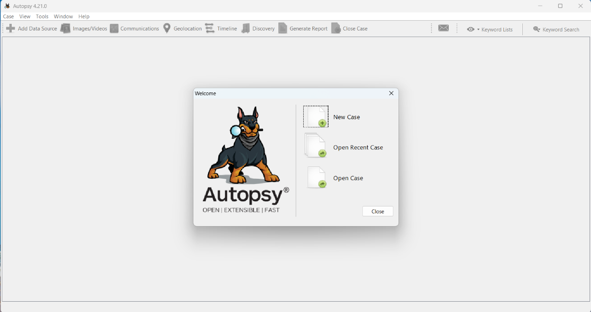
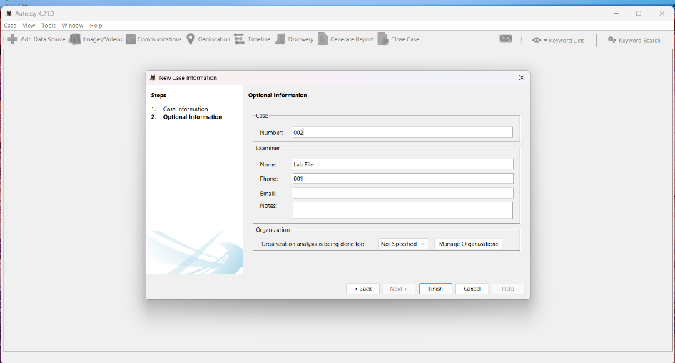
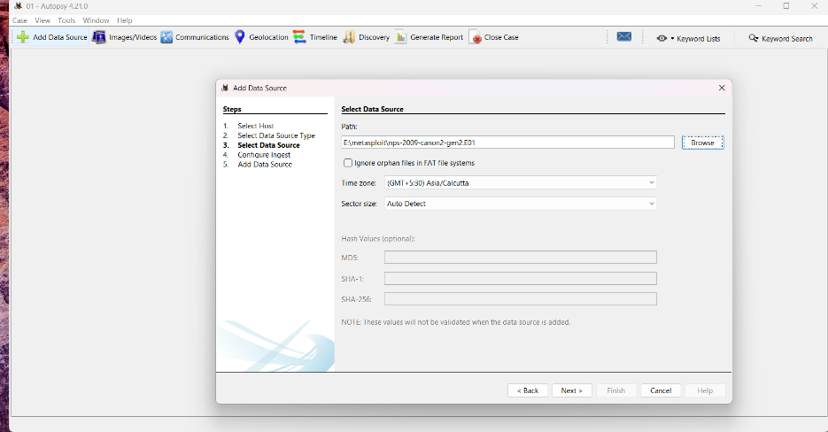
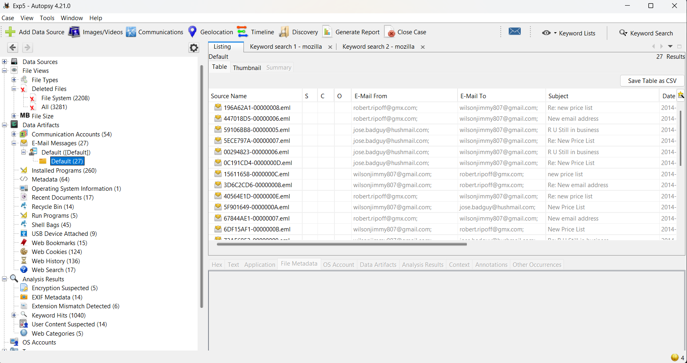
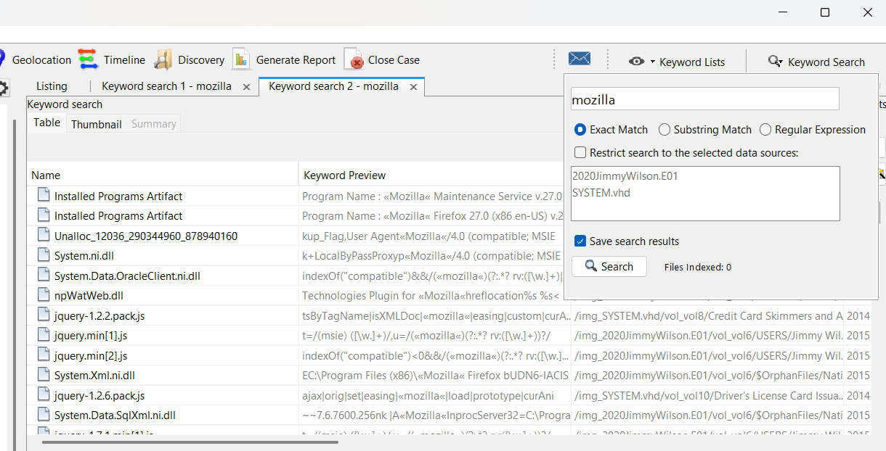
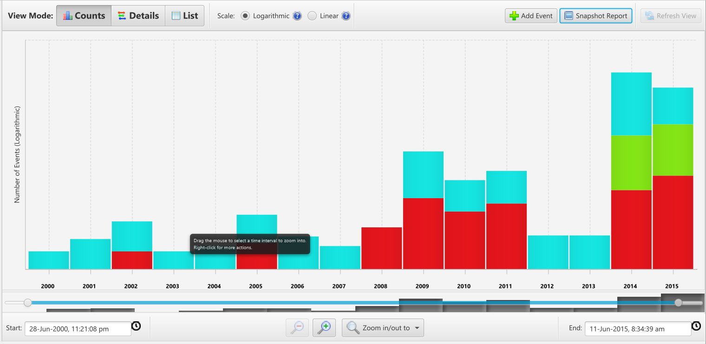
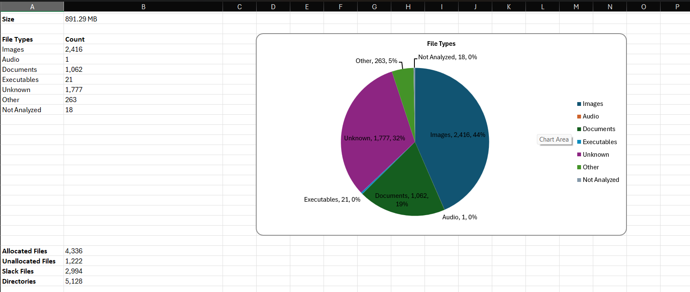

# Disk Image Forensic Investigation using Autopsy

## Category

Digital Forensics & Incident Response

## Summary

Conducted a disk image forensic investigation in Autopsy, focusing on file system review, keyword searching, timeline analysis, and report generation. The strongest part of this lab was using timeline analysis to reconstruct user or attacker activity in chronological order, which mirrors how DFIR analysts investigate real incidents.

## Objective

The objective was to examine a disk image using Autopsy and document evidence from three core forensic workflows:

- File analysis for file types, sizes, metadata, and timestamps
- Keyword search for identifying potentially relevant evidence
- Timeline analysis for reconstructing event order

## Tools Used

- Autopsy
- Linux lab environment
- Legally obtained disk image for educational forensic analysis

## Process

1. Prepared the lab environment and confirmed Autopsy was available on the analysis system.
2. Launched Autopsy from the installation directory using `./autopsy`.
3. Created a new case with case details, examiner information, and storage location.
4. Added the disk image as the data source for analysis.
5. Reviewed the file system from the File Analysis tab, including file types, sizes, and timestamps.
6. Used Keyword Search to locate files containing relevant terms or phrases.
7. Generated a timeline from the disk image and reviewed activity chronologically.
8. Exported reports for file listing, keyword search results, and timeline findings.

## Key Findings

- File Analysis: Autopsy provided a structured view of the disk image file system, allowing files of interest to be reviewed by metadata, path, size, type, and timestamps.
- Keyword Search: Search results helped narrow the investigation from the full disk image to files containing investigator-defined terms.
- Timeline Analysis: Timeline generation created a chronological sequence of events from file system timestamps, making it possible to reconstruct activity patterns instead of reviewing artifacts in isolation.
- Reports: Exported reports preserved the investigation output for documentation and review.

## Evidence

### Screenshots

### Downloadable Report

- [Download the lab PDF](reports/autopsy-disk-investigation.pdf)

## What I Learned

This lab showed why timeline analysis is central to DFIR work. A file listing can show what exists on disk, and keyword search can identify relevant artifacts, but the timeline helps explain how activity unfolded. That chronological view is what turns isolated artifacts into an investigation narrative.

## Scope and Ethics

This project used a disk image obtained legally for educational and training purposes. The investigation was performed in a controlled lab environment and documented for defensive forensic analysis practice.
