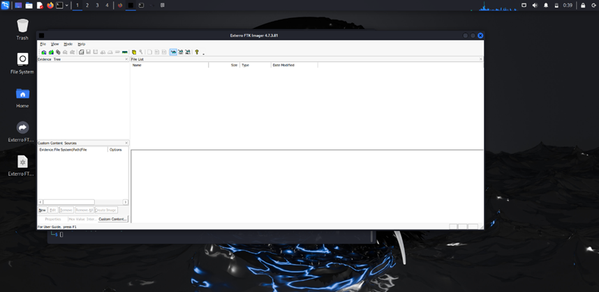
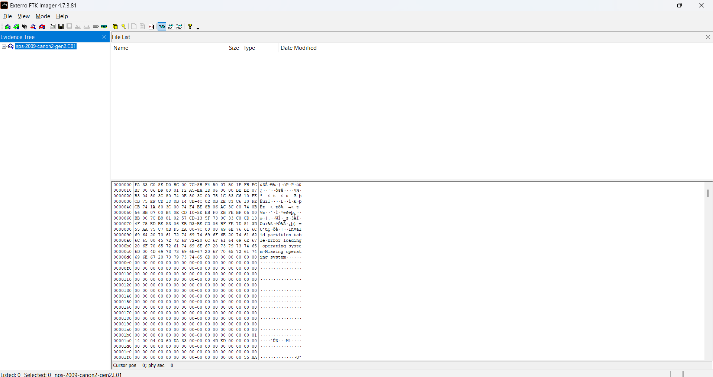
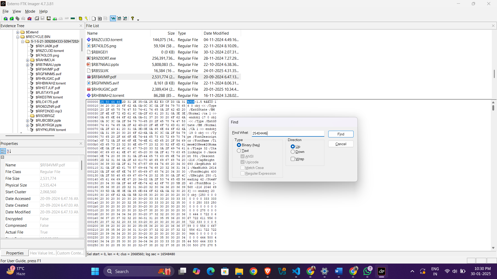
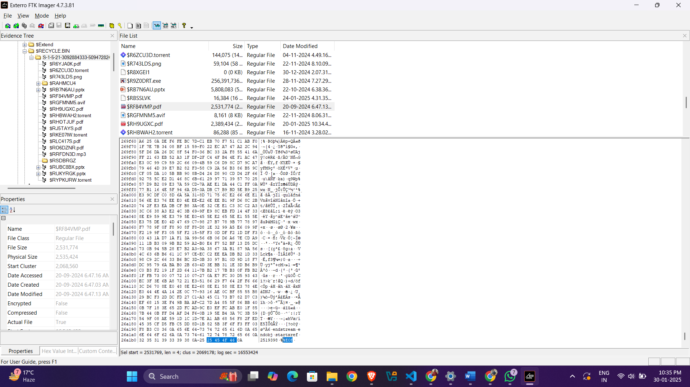
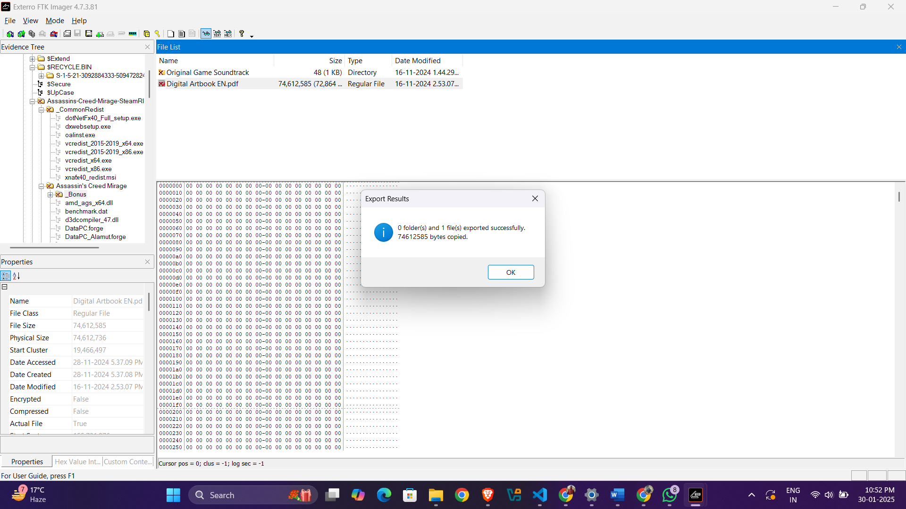
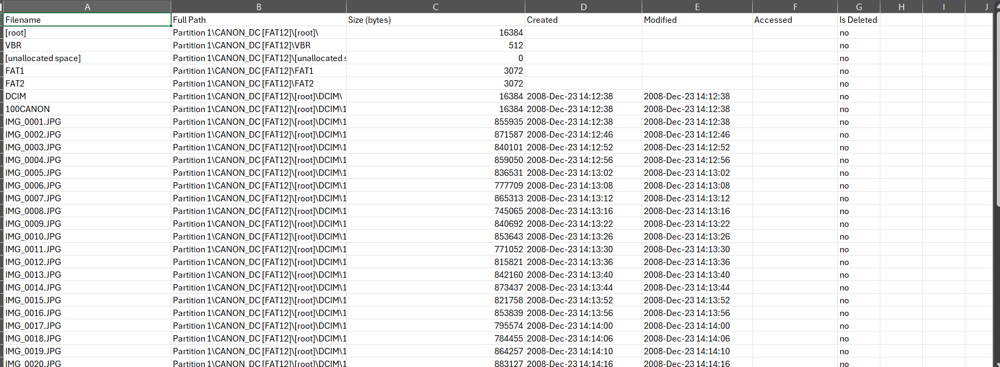

# File Recovery & Evidence Analysis using FTK Imager

## Category

Digital Forensics & Incident Response

## Summary

Conducted a file forensics investigation using FTK Imager, focusing on searching for files, analyzing evidence, and recovering deleted files from a disk image. The strongest finding was validating a recovered PDF using hexadecimal file signature analysis: the PDF header `25 50 44 46` and EOF marker `25 45 4F 46`.

## Objective

The objective was to use FTK Imager to investigate a disk image, locate files of interest, validate recovered evidence, and document deleted file recovery findings.

## Tools Used

- FTK Imager
- Kali Linux
- Wine for running FTK Imager on Linux
- Legally obtained disk image for educational forensic analysis

## Process

1. Installed Wine on Kali Linux to support running FTK Imager.
2. Launched FTK Imager and created a new case.
3. Imported the disk image into FTK Imager for analysis.
4. Searched the image for files and reviewed evidence paths.
5. Performed a hexadecimal search for the PDF header `25 50 44 46`.
6. Validated suspected PDF files by searching for the EOF marker `25 45 4F 46`.
7. Reviewed deleted or recovered files, including artifacts from `/root/$RECYCLEBIN/`.
8. Generated an evidence report documenting the findings.

## Key Finding: PDF Signature Validation

The most important forensic technique in this lab was validating a recovered PDF by checking both the file header and the EOF marker:

- PDF header: `25 50 44 46`
- EOF marker: `25 45 4F 46`
- Evidence path: `/root/$RECYCLEBIN/`
- Validated file: `$RF84VMP.pdf`

Finding both markers supports the conclusion that the recovered artifact is a valid PDF rather than only a partial or mislabeled file.

## Findings Table

| File Name | File Path | File Signature Found | EOF Marker Found | Status |
| --- | --- | --- | --- | --- |
| `$RF84VMP.pdf` | `/root/$RECYCLEBIN/` | Yes (`25 50 44 46`) | Yes (`25 45 4F 46`) | Valid PDF |
| `Digital Artbook EN.pdf` | `/Assassin's creed Mirage/Bonus` | No | No | Corrupt/Incomplete |
| `unknown.bin` | `/Unallocated Space/` | Yes (`25 50 44 46`) | No | Possible Fragment |

## Evidence

### Screenshots

### Downloadable Report

- [Download the lab PDF](reports/ftk-file-recovery.pdf)

## What I Learned

This lab showed that file recovery is stronger when supported by signature validation. A filename or extension alone is not enough. Checking the header and EOF marker gives a more defensible basis for classifying a recovered artifact as valid, corrupt, incomplete, or fragmented.

## Scope and Ethics

This project used a disk image obtained legally for educational and training purposes. The analysis was performed in a controlled lab and documented for defensive forensic investigation practice.
