# DoS Attack Simulation & Traffic Analysis on Metasploitable 2

## Category

Network analysis / Threat detection

## Summary

Simulated 6 types of DoS attacks on a vulnerable VM and captured and analysed attack traffic patterns using Wireshark.

## Objective

The goal of this project was to understand how denial-of-service traffic appears in packet captures so the same patterns can be recognized during SOC monitoring, alert triage, and incident investigation. All activity was performed inside an isolated lab using Kali Linux and Metasploitable 2.

## Tools Used

- Kali Linux, Metasploitable 2, VirtualBox
- hping3, Nmap scripting engine, Slowloris Perl script
- Wireshark

## Process

1. Configured an isolated lab environment with Kali Linux and Metasploitable 2 running in VirtualBox.
2. Set both VMs to a bridged network adapter and identified the Metasploitable target IP.
3. Executed Slowloris using the Nmap NSE script and a Perl implementation, then captured the HTTP partial request behavior.
4. Executed TCP SYN flood traffic and reviewed the half-open connection pattern in Wireshark.
5. Executed UDP flood traffic and reviewed the ICMP Destination Unreachable response pattern.
6. Executed TCP FIN, TCP PUSH+ACK, and ICMP flood traffic, then documented the traffic signature for each attack type.

## Key Findings

- Slowloris: Wireshark showed repeated HTTP connection attempts designed to keep server-side connections open instead of completing normal request handling.
- TCP SYN flood: The capture showed a high volume of SYN packets without normal handshake completion, indicating half-open connection pressure.
- UDP flood: The capture showed UDP packets sent to the target with ICMP Destination Unreachable responses when no service was listening.
- TCP FIN flood: Wireshark showed repeated TCP packets with the FIN flag set, creating abnormal connection termination traffic.
- TCP PUSH+ACK flood: Wireshark showed repeated TCP packets with PSH and ACK behavior, forcing immediate packet processing.
- ICMP flood: The capture showed sustained ICMP Echo Request traffic that could consume network bandwidth and host resources.

## Evidence

### Downloadable Report

- [Download the lab PDF](reports/dos-attack-simulation.pdf)

### Lab Setup

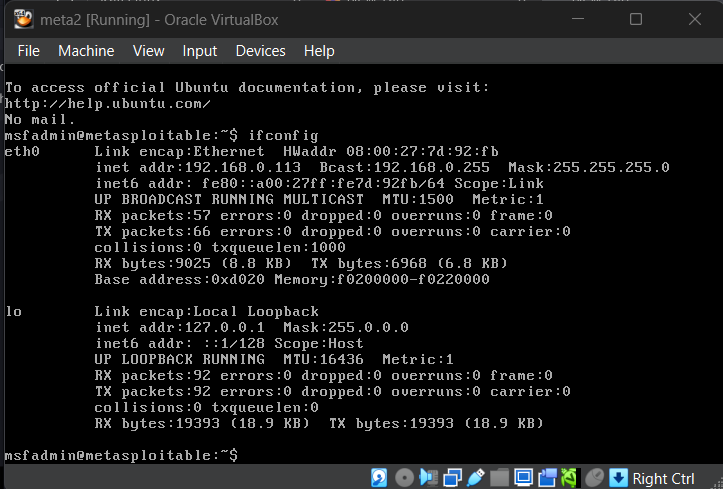
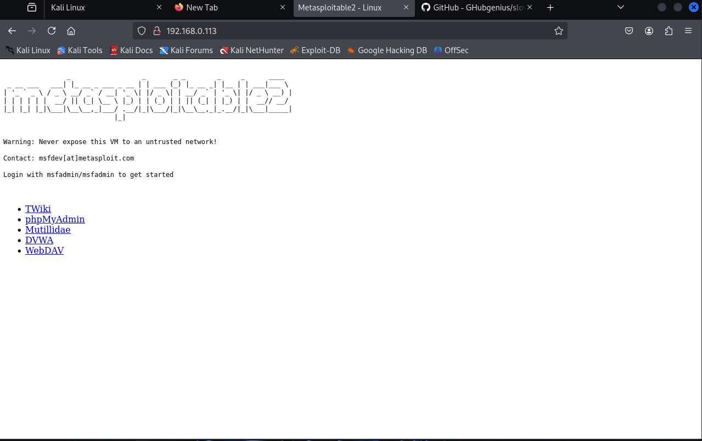

### Slowloris

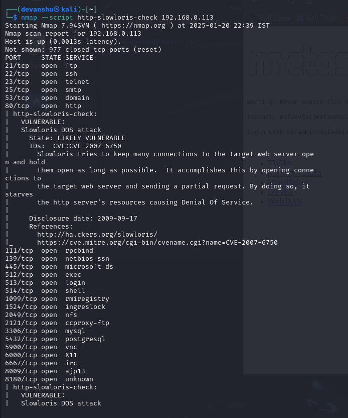
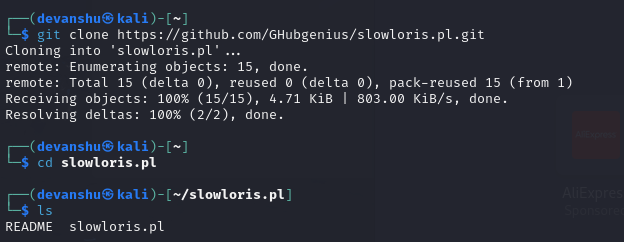
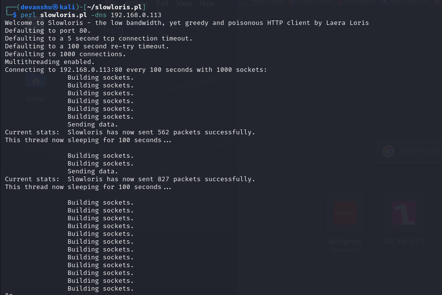

### TCP SYN Flood

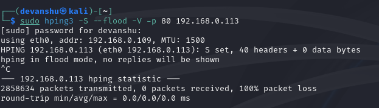
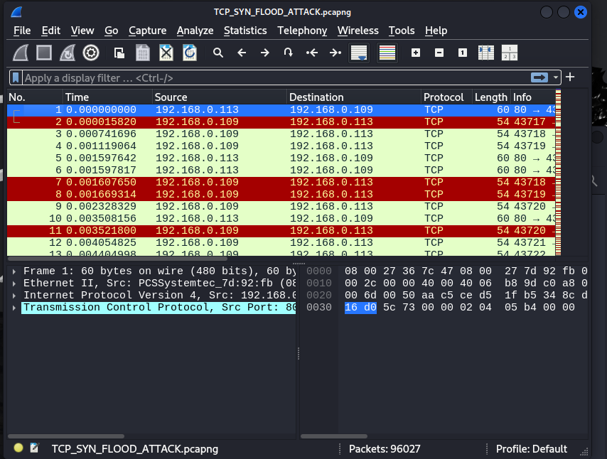

### UDP Flood

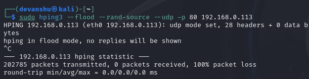
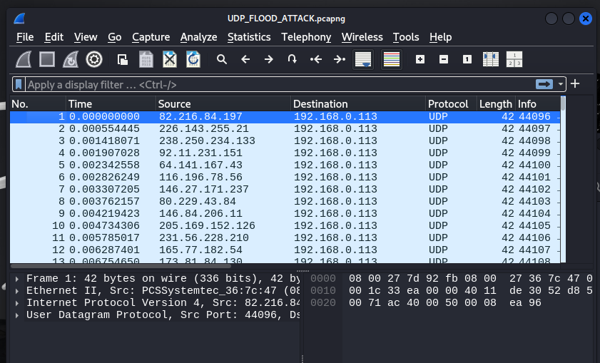

### TCP FIN Flood

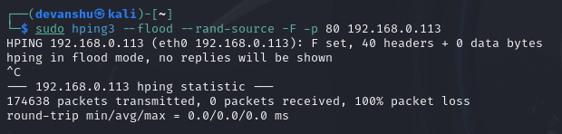
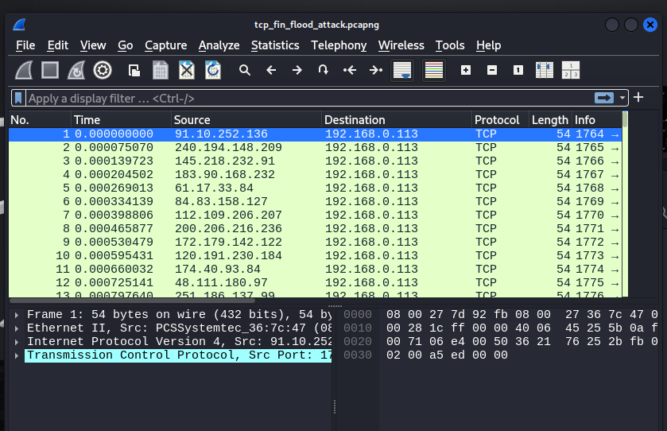

### TCP PUSH+ACK Flood

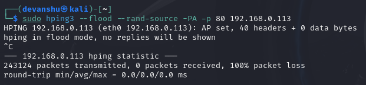
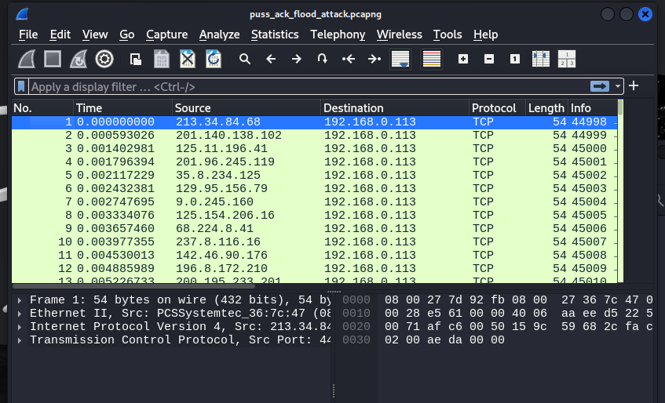

### ICMP Flood

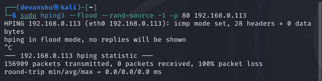
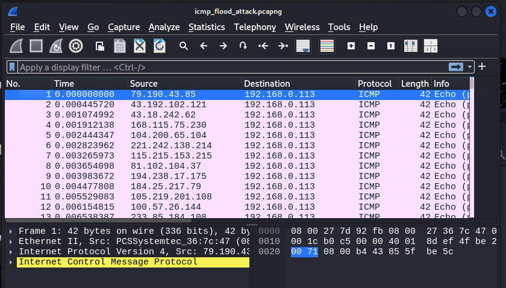

## What I Learned

This lab helped me connect command-line attack simulation with packet-level evidence in Wireshark. The important part was not only running traffic generators, but learning how each attack changes protocol behavior and what indicators a SOC analyst could use during detection or triage.

I also learned that a strong security writeup needs evidence for both sides of the activity: the command that generated the lab traffic and the packet capture that proves what happened on the wire.

## Scope and Ethics

This project was performed only in a controlled local lab against Metasploitable 2, a deliberately vulnerable VM. The commands and observations are documented for defensive learning, packet analysis practice, and threat detection awareness.
